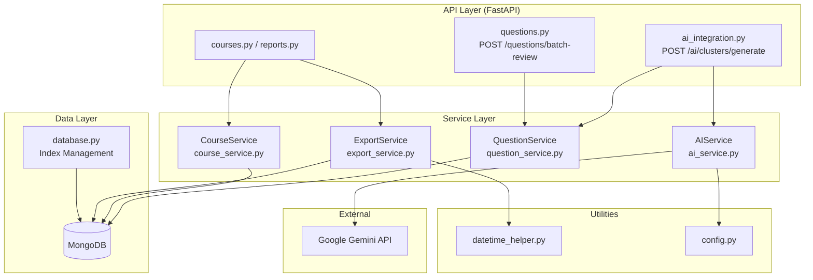
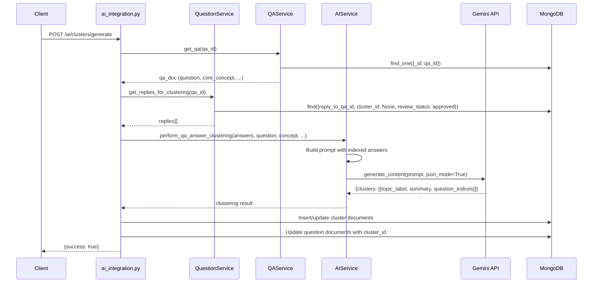
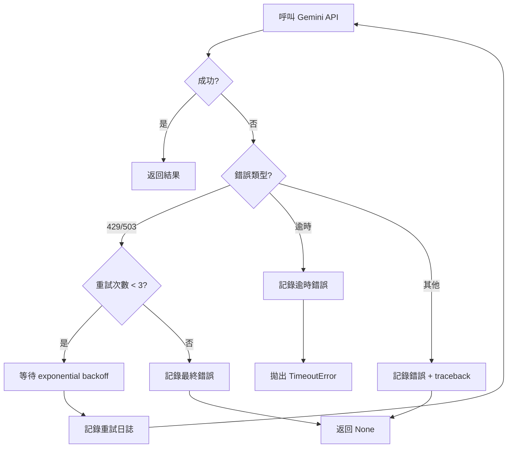

# Design Document: AI Clustering Tests & Backend Optimization

## Overview

本設計文件涵蓋兩大工作項目的技術設計：

1. **AI 聚類管線整合測試**：針對 `ai_service.py` 與 `ai_integration.py` 中的聚類分析流程，建立完整的整合測試套件，驗證從取得已審核回答、建構提示詞、呼叫 Gemini API、解析回應到寫入 MongoDB 的端到端正確性。

2. **後端程式碼優化**：全面提升 `backend/app/` 的程式碼品質，包含：
   - 消除 `course_service.py`、`export_service.py`、`questions.py` 中的 N+1 查詢
   - 在 `database.py` 啟動時建立 MongoDB 索引
   - 強化錯誤處理與 ObjectId 驗證
   - 將 AI Service 的同步 Gemini 呼叫改為非同步並加入重試/逾時機制
   - CORS 安全性加固
   - 提示詞優化

技術棧：FastAPI + MongoDB (Motor async driver) + Google Gemini AI (`google-genai` SDK) + pytest + pytest-asyncio

## Architecture

### 系統架構概覽



### 聚類管線流程



### 變更影響範圍

| 檔案 | 變更類型 | 說明 |
|------|---------|------|
| `backend/app/services/ai_service.py` | 重構 | 同步→非同步、加入重試/逾時、提示詞優化 |
| `backend/app/services/course_service.py` | 優化 | N+1 查詢消除 (aggregation pipeline) |
| `backend/app/services/export_service.py` | 優化 | N+1 查詢消除 (bulk query) |
| `backend/app/api/questions.py` | 優化 | batch_update 改用 update_many |
| `backend/app/api/ai_integration.py` | 重構 | 配合 async AI service、強化錯誤處理 |
| `backend/app/database.py` | 新增 | 啟動時建立索引 |
| `backend/app/main.py` | 修改 | CORS 安全性加固 |
| `backend/app/config.py` | 新增 | AI 重試/逾時設定 |
| `backend/app/utils/datetime_helper.py` | 新增 | 共用日期區間查詢建構器 |
| `backend/tests/` | 新增 | 整合測試套件 |


## Components and Interfaces

### 1. AIService 重構 (`ai_service.py`)

**變更：同步→非同步 + 重試/逾時**

```python
# config.py 新增設定
GEMINI_RETRY_MAX_ATTEMPTS: int = 3
GEMINI_RETRY_BASE_DELAY: float = 1.0  # 秒，指數退避基底
GEMINI_TIMEOUT_SECONDS: float = 30.0

# ai_service.py 核心介面變更
class AIService:
    async def _call_gemini(
        self,
        prompt: str,
        json_mode: bool = False,
        temperature: float = 0.7
    ) -> Any:
        """非同步 Gemini API 呼叫，含重試與逾時"""
        ...

    async def perform_qa_answer_clustering(
        self,
        student_answers: List[str],
        teacher_question: str,
        core_concept: str,
        expected_misconceptions: Optional[str] = None,
        max_clusters: int = 5,
        existing_topics: List[str] = None
    ) -> Dict[str, Any]:
        """非同步聚類分析"""
        ...

    async def generate_response_draft(self, question_text: str) -> str: ...
    async def analyze_question(self, question_text: str) -> Dict[str, Any]: ...
    async def get_reply(self, user_message: str, system_prompt: str = None) -> str: ...
```

**重試機制設計：**
- 使用 `asyncio.sleep()` 實現指數退避：delay = `base_delay * (2 ** attempt)`
- 僅對 HTTP 429 (Rate Limit) 和 503 (Service Unavailable) 進行重試
- 使用 `asyncio.wait_for()` 實現 30 秒逾時
- 重試次數與延遲透過 `config.py` 設定

### 2. CourseService N+1 消除 (`course_service.py`)

**變更：`get_courses` 方法**

現行問題：在 `for c in courses` 迴圈中，每個課程各執行 2 次 `count_documents` 查詢。

解決方案：使用 MongoDB aggregation pipeline 一次取得所有課程的統計數據。

```python
async def get_courses(self, ...) -> List[Dict[str, Any]]:
    # 1. 取得課程列表
    courses = await cursor.to_list(length=limit)
    course_ids = [str(c["_id"]) for c in courses]

    # 2. 批次查詢 question_count (單次 aggregate)
    q_pipeline = [
        {"$match": {"course_id": {"$in": course_ids}, "status": {"$ne": "DELETED"}}},
        {"$group": {"_id": "$course_id", "count": {"$sum": 1}}}
    ]
    q_stats = {s["_id"]: s["count"] for s in await questions_collection.aggregate(q_pipeline).to_list(None)}

    # 3. 批次查詢 student_count (單次 aggregate)
    s_pipeline = [
        {"$match": {"current_course_id": {"$in": course_ids}}},
        {"$group": {"_id": "$current_course_id", "count": {"$sum": 1}}}
    ]
    s_stats = {s["_id"]: s["count"] for s in await line_users_collection.aggregate(s_pipeline).to_list(None)}

    # 4. 合併結果
    for c in courses:
        cid = str(c["_id"])
        c["_id"] = cid
        c["question_count"] = q_stats.get(cid, 0)
        c["student_count"] = s_stats.get(cid, 0)
```

### 3. ExportService N+1 消除 (`export_service.py`)

**變更：`export_qas_to_csv` 方法**

現行問題：在 `for qa in qas` 迴圈中，每個 QA 各執行 1 次 `find` 查詢取得回覆。

解決方案：先批次取得所有 QA 的回覆，再用 dict 映射。

```python
async def export_qas_to_csv(self, ...) -> str:
    qas = await cursor.to_list(length=None)
    qa_ids = [str(qa["_id"]) for qa in qas]

    # 單次批次查詢所有回覆
    all_replies_cursor = question_collection.find(
        {"reply_to_qa_id": {"$in": qa_ids}}
    ).sort("created_at", 1)
    all_replies = await all_replies_cursor.to_list(length=None)

    # 建立 qa_id -> replies 映射
    replies_map: Dict[str, List] = {}
    for r in all_replies:
        qa_id = r.get("reply_to_qa_id")
        replies_map.setdefault(qa_id, []).append(r)

    # 寫入 CSV 時直接從 map 取得
    for qa in qas:
        replies = replies_map.get(str(qa["_id"]), [])
        ...
```

### 4. Batch Review 優化 (`questions.py`)

**變更：`batch_update_review_status` endpoint**

現行問題：在 `for q_id in batch_data.question_ids` 迴圈中逐筆呼叫 `update_review_status`。

解決方案：使用單次 `update_many` 操作。

```python
@router.post("/batch-review")
async def batch_update_review_status(batch_data: ReviewStatusBatchUpdate):
    from bson import ObjectId
    database = db.get_db()
    collection = database["questions"]

    object_ids = [ObjectId(qid) for qid in batch_data.question_ids]
    update_fields = {
        "review_status": batch_data.review_status,
        "updated_at": datetime.utcnow()
    }
    if batch_data.feedback is not None:
        update_fields["feedback"] = batch_data.feedback

    result = await collection.update_many(
        {"_id": {"$in": object_ids}},
        {"$set": update_fields}
    )
    return {
        "success": True,
        "message": f"批量批閱完成！成功: {result.modified_count} 筆",
        "modified_count": result.modified_count
    }
```

### 5. 資料庫索引管理 (`database.py`)

**新增：`ensure_indexes` 方法**

```python
class Database:
    @classmethod
    async def ensure_indexes(cls):
        """建立所有集合的索引"""
        db = cls.get_db()

        # questions 集合
        await db["questions"].create_index("course_id")
        await db["questions"].create_index("reply_to_qa_id")
        await db["questions"].create_index("cluster_id")
        await db["questions"].create_index("review_status")
        await db["questions"].create_index([("reply_to_qa_id", 1), ("pseudonym", 1)])

        # clusters 集合
        await db["clusters"].create_index("course_id")
        await db["clusters"].create_index("qa_id")
        await db["clusters"].create_index([("course_id", 1), ("qa_id", 1)])

        # qas 集合
        await db["qas"].create_index("course_id")
        await db["qas"].create_index([("course_id", 1), ("allow_replies", 1), ("expires_at", 1)])

        # line_users 集合
        await db["line_users"].create_index("current_course_id")
```

在 `main.py` 的 `lifespan` 中呼叫：
```python
async def lifespan(app: FastAPI):
    await db.connect_db()
    await db.ensure_indexes()
    yield
    await db.close_db()
```

### 6. CORS 安全性加固 (`main.py`)

```python
app.add_middleware(
    CORSMiddleware,
    allow_origins=settings.cors_origins_list,
    allow_credentials=True,
    allow_methods=["GET", "POST", "PATCH", "DELETE", "OPTIONS"],
    allow_headers=["Content-Type", "Authorization", "Accept", "Origin", "X-Requested-With"],
)
```

### 7. 共用日期區間查詢建構器 (`datetime_helper.py`)

```python
def build_date_range_query(
    start_date: Optional[datetime] = None,
    end_date: Optional[datetime] = None,
    field_name: str = "created_at"
) -> Dict[str, Any]:
    """建構 MongoDB 日期區間查詢條件"""
    if not start_date and not end_date:
        return {}
    query = {}
    date_filter = {}
    if start_date:
        date_filter["$gte"] = start_date
    if end_date:
        adjusted_end = end_date.replace(hour=23, minute=59, second=59, microsecond=999999)
        date_filter["$lte"] = adjusted_end
    if date_filter:
        query[field_name] = date_filter
    return query
```

### 8. 錯誤處理強化

**ObjectId 驗證模式：**

所有接收 MongoDB ObjectId 參數的 API endpoint 都需加入驗證：

```python
from bson import ObjectId

def validate_object_id(id_str: str, name: str = "ID") -> ObjectId:
    """驗證並轉換 ObjectId，無效時拋出 HTTPException"""
    if not ObjectId.is_valid(id_str):
        raise HTTPException(status_code=400, detail=f"無效的{name}格式: {id_str}")
    return ObjectId(id_str)
```

### 9. 測試架構

```
backend/
├── tests/
│   ├── __init__.py
│   ├── conftest.py              # 共用 fixtures (mock DB, mock AI)
│   ├── test_clustering_pipeline.py  # Req 1-5: 聚類管線整合測試
│   ├── test_n_plus_one.py           # Req 6: N+1 消除驗證
│   ├── test_ai_service.py           # Req 3, 11: AI Service 單元測試
│   └── test_error_handling.py       # Req 8: 錯誤處理測試
```

測試框架：`pytest` + `pytest-asyncio` + `unittest.mock` (AsyncMock)
屬性測試框架：`hypothesis`


## Data Models

### MongoDB 集合結構（現有，無變更）

**questions 集合**
```json
{
  "_id": ObjectId,
  "course_id": "string",
  "class_id": "string | null",
  "pseudonym": "string",
  "student_id": "string | null",
  "question_text": "string",
  "review_status": "pending | approved | rejected",
  "feedback": "string | null",
  "cluster_id": "string | null",
  "difficulty_score": "float | null",
  "difficulty_level": "easy | medium | hard | null",
  "keywords": ["string"],
  "ai_response_draft": "string | null",
  "ai_summary": "string | null",
  "reply_to_qa_id": "string | null",
  "source": "LINE | WEB",
  "created_at": "datetime",
  "updated_at": "datetime"
}
```

**clusters 集合**
```json
{
  "_id": ObjectId,
  "course_id": "string",
  "qa_id": "string | null",
  "topic_label": "string",
  "summary": "string",
  "keywords": ["string"],
  "question_count": "int",
  "avg_difficulty": "float",
  "is_locked": "boolean",
  "manual_label": "string | null",
  "created_at": "datetime",
  "updated_at": "datetime"
}
```

**qas 集合**
```json
{
  "_id": ObjectId,
  "course_id": "string",
  "class_id": "string | null",
  "question": "string",
  "core_concept": "string",
  "expected_misconceptions": "string | null",
  "category": "string | null",
  "tags": ["string"],
  "is_published": "boolean",
  "allow_replies": "boolean",
  "duration_minutes": "int | null",
  "expires_at": "datetime | null",
  "max_attempts": "int | null",
  "created_by": "string",
  "created_at": "datetime",
  "updated_at": "datetime"
}
```

### 新增設定欄位 (`config.py`)

```python
# AI 重試與逾時設定
GEMINI_RETRY_MAX_ATTEMPTS: int = 3
GEMINI_RETRY_BASE_DELAY: float = 1.0
GEMINI_TIMEOUT_SECONDS: float = 30.0
```

### 新增索引定義

| 集合 | 索引欄位 | 類型 | 用途 |
|------|---------|------|------|
| questions | `course_id` | 單欄位 | 課程篩選查詢 |
| questions | `reply_to_qa_id` | 單欄位 | QA 回覆查詢 |
| questions | `cluster_id` | 單欄位 | 聚類篩選查詢 |
| questions | `review_status` | 單欄位 | 批閱狀態篩選 |
| questions | `{reply_to_qa_id: 1, pseudonym: 1}` | 複合索引 | 作答次數限制檢查 |
| clusters | `course_id` | 單欄位 | 課程聚類查詢 |
| clusters | `qa_id` | 單欄位 | QA 聚類查詢 |
| clusters | `{course_id: 1, qa_id: 1}` | 複合索引 | 課程+QA 聚類查詢 |
| qas | `course_id` | 單欄位 | 課程 QA 列表 |
| qas | `{course_id: 1, allow_replies: 1, expires_at: 1}` | 複合索引 | 限時互動查詢 |
| line_users | `current_course_id` | 單欄位 | 學生數統計 |


## Correctness Properties

*A property is a characteristic or behavior that should hold true across all valid executions of a system — essentially, a formal statement about what the system should do. Properties serve as the bridge between human-readable specifications and machine-verifiable correctness guarantees.*

### Property 1: Reply filtering correctness

*For any* set of question documents in the database with varying `review_status` and `cluster_id` values, calling `get_replies_for_clustering(qa_id)` shall return only those documents where `review_status == "approved"` AND `cluster_id is None` AND `reply_to_qa_id == qa_id`.

**Validates: Requirements 1.1, 1.3**

### Property 2: Reply output shape

*For any* reply returned by `get_replies_for_clustering`, the returned dictionary shall contain exactly the keys `_id`, `pseudonym`, `answer_text`, and `created_at`, and none of these values shall be missing.

**Validates: Requirements 1.2**

### Property 3: Reply limit constraint

*For any* positive integer `limit` and any set of matching question documents, `len(get_replies_for_clustering(qa_id, limit=limit))` shall be less than or equal to `limit`.

**Validates: Requirements 1.4**

### Property 4: Prompt construction completeness

*For any* combination of `teacher_question`, `core_concept`, `expected_misconceptions`, `student_answers` list, `existing_topics` list, and `max_clusters` value, the prompt constructed by `perform_qa_answer_clustering` shall contain: (a) the teacher_question string, (b) the core_concept string, (c) the expected_misconceptions string (if provided), (d) each student answer prefixed with its sequential index `ID_i`, (e) each existing topic label (if provided), and (f) the max_clusters number.

**Validates: Requirements 2.1, 2.2, 2.3, 12.3**

### Property 5: Invalid JSON resilience

*For any* string that is not valid JSON, when `_call_gemini` receives it as a response in `json_mode=True`, the method shall return an empty dictionary `{}`.

**Validates: Requirements 3.4**

### Property 6: Clustering pipeline end-to-end correctness

*For any* valid Gemini API clustering response containing N clusters with valid `question_indices`, the pipeline shall: (a) create exactly N new cluster documents in the `clusters` collection each containing `topic_label`, `summary`, `course_id`, and `qa_id`, and (b) update each referenced question document's `cluster_id` to the correct cluster's `_id`.

**Validates: Requirements 4.1, 4.2, 4.3**

### Property 7: Course counts aggregation correctness

*For any* set of courses, questions, and line_users documents in the database, calling `get_courses()` shall return each course with `question_count` equal to the actual count of non-DELETED questions for that course, and `student_count` equal to the actual count of line_users with `current_course_id` matching that course.

**Validates: Requirements 6.1**

### Property 8: QA export reply completeness

*For any* set of QA tasks and their associated student replies, calling `export_qas_to_csv` shall produce CSV output where every reply is correctly associated with its parent QA task, and no replies are missing or misattributed.

**Validates: Requirements 6.2**

### Property 9: Batch update correctness

*For any* list of valid question IDs and a target `review_status`, calling `batch_update_review_status` shall result in all specified question documents having their `review_status` set to the target value.

**Validates: Requirements 6.3**

### Property 10: ObjectId validation

*For any* string that is not a valid MongoDB ObjectId (e.g., strings with invalid characters, wrong length, or empty strings), any API endpoint receiving it as an ID parameter shall return HTTP 400 without executing a database query.

**Validates: Requirements 8.2, 10.1**

### Property 11: Student answer truncation

*For any* student answer string, the version included in the clustering prompt shall have length at most 300 characters. If the original answer exceeds 300 characters, only the first 300 characters shall appear.

**Validates: Requirements 12.4**


## Error Handling

### 錯誤處理策略

| 層級 | 策略 | 說明 |
|------|------|------|
| API Layer | `HTTPException` | 所有錯誤以 `{"detail": "message"}` 格式回傳 |
| Service Layer | 具體例外 | 使用 `ValueError`、`RuntimeError` 取代 return None |
| AI Service | 重試 + 降級 | 暫時性錯誤重試，最終失敗返回 None 並記錄日誌 |
| Database | 索引 + 驗證 | ObjectId 驗證在查詢前執行 |

### ObjectId 驗證

所有接收 ObjectId 參數的 endpoint 統一使用驗證函式：

```python
def validate_object_id(id_str: str, name: str = "ID") -> ObjectId:
    if not ObjectId.is_valid(id_str):
        raise HTTPException(status_code=400, detail=f"無效的{name}格式: {id_str}")
    return ObjectId(id_str)
```

適用端點：
- `GET /questions/{question_id}`
- `PATCH /questions/{question_id}/review`
- `DELETE /questions/{question_id}`
- `POST /ai/clusters/generate` (course_id, qa_id)
- `GET /ai/clusters/{course_id}`
- `PATCH /ai/clusters/{cluster_id}`
- `DELETE /ai/clusters/{cluster_id}`

### AI Service 錯誤處理流程



### 錯誤回應格式

```json
// HTTP 400 - 無效輸入
{"detail": "無效的ID格式: abc123"}

// HTTP 404 - 資源不存在
{"detail": "找不到此作答紀錄"}

// HTTP 500 - 內部錯誤
{"detail": "聚類分析失敗: AI 回傳格式錯誤"}
```

## Testing Strategy

### 測試框架

- **單元測試 / 整合測試**: `pytest` + `pytest-asyncio`
- **屬性測試 (Property-Based Testing)**: `hypothesis`
- **Mock**: `unittest.mock.AsyncMock` (用於 mock MongoDB 和 Gemini API)

### 雙軌測試方法

**單元測試 (Unit Tests)** — 驗證具體範例、邊界條件、錯誤情境：
- 空回答列表時返回 `{"clusters": []}`（Req 2.4）
- API Key 為空時拋出 ValueError（Req 3.3）
- Gemini 回應缺少 `clusters` key 時拋出 ValueError（Req 4.4）
- 無已審核回答時返回成功訊息（Req 5.1）
- Gemini 401/403 錯誤處理（Req 5.2）
- Gemini 異常時返回 HTTP 500（Req 5.3）
- 索引建立驗證（Req 7.1-7.4）
- AI Service 函式為 async coroutine（Req 9.3）
- CORS 設定驗證（Req 10.2, 10.3）
- 重試機制驗證（Req 11.1-11.4）
- 提示詞包含繁體中文指令（Req 12.1）
- 提示詞包含電商領域指引（Req 12.2）

**屬性測試 (Property-Based Tests)** — 驗證跨所有輸入的通用性質：
- 每個屬性測試至少執行 100 次迭代
- 每個測試以註解標記對應的設計文件屬性
- 標記格式：`Feature: ai-clustering-tests-and-backend-optimization, Property {number}: {title}`

### 屬性測試對應表

| Property | 測試描述 | 生成器策略 |
|----------|---------|-----------|
| Property 1 | 回覆篩選正確性 | 生成隨機 question documents (混合 review_status, cluster_id) |
| Property 2 | 回覆輸出欄位完整性 | 生成隨機 question documents |
| Property 3 | 回覆數量限制 | 生成隨機 limit 值 (1-500) 與隨機數量的 documents |
| Property 4 | 提示詞建構完整性 | 生成隨機字串 (teacher_question, core_concept, answers, topics) |
| Property 5 | 無效 JSON 處理 | 生成隨機非 JSON 字串 |
| Property 6 | 聚類管線端到端正確性 | 生成隨機 clustering response (valid indices, topic_labels) |
| Property 7 | 課程統計正確性 | 生成隨機 courses, questions, line_users documents |
| Property 8 | QA 匯出完整性 | 生成隨機 QA tasks 與 replies |
| Property 9 | 批次更新正確性 | 生成隨機 question IDs 與 review_status |
| Property 10 | ObjectId 驗證 | 生成隨機無效 ObjectId 字串 |
| Property 11 | 回答截斷 | 生成隨機長度字串 (0-1000 字元) |

### 測試檔案結構

```
backend/
├── tests/
│   ├── __init__.py
│   ├── conftest.py                    # 共用 fixtures
│   ├── test_clustering_pipeline.py    # Req 1-5 整合測試 + Property 1-6
│   ├── test_n_plus_one.py             # Req 6 N+1 消除 + Property 7-9
│   ├── test_ai_service.py             # Req 3, 11, 12 AI Service + Property 4-5, 11
│   ├── test_error_handling.py         # Req 8, 10 錯誤處理 + Property 10
│   └── test_database_indexes.py       # Req 7 索引驗證
```

### Hypothesis 設定

```python
from hypothesis import given, settings, strategies as st

@settings(max_examples=100)
@given(...)
def test_property_name(...):
    # Feature: ai-clustering-tests-and-backend-optimization, Property N: title
    ...
```

### Mock 策略

- **MongoDB**: 使用 `AsyncMock` mock `database["collection"]` 的 `find`, `insert_one`, `update_many`, `aggregate` 等方法
- **Gemini API**: 使用 `unittest.mock.patch` mock `genai.Client.models.generate_content`，控制回傳值與例外
- **Config**: 使用 `monkeypatch` 覆寫 `settings` 屬性

